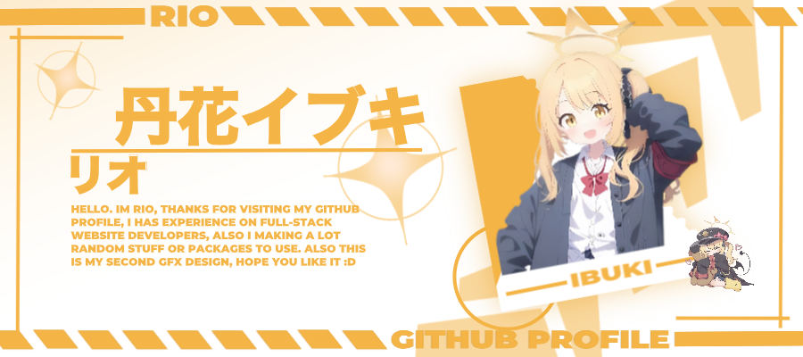

<picture>
  
</picture>

---
<h3 align='center'>I'm Currently Learning</h3>

  <picture>
    
  </picture>

---

<h3 align='center'>Tools & Languages I'm Currently Used</h3>

  <picture>
    
  </picture>

  <picture>
    
  </picture>

---

  <h3>Stats</h3>

  

    <picture>
      <source
        srcset='https://github-readme-stats.vercel.app/api/top-langs?username=nokarin-dev&show_icons=true&locale=en&layout=compact&theme=transparent&hide_border=true'
        media='(prefers-color-scheme: dark)'
      />
      <source
        srcset='https://github-readme-stats.vercel.app/api/top-langs?username=nokarin-dev&show_icons=true'
        media='(prefers-color-scheme: light), (prefers-color-scheme: no-preference)'
      />
      
    </picture>
  

  

    <picture>
      <source
        srcset='https://github-readme-stats.vercel.app/api?username=nokarin-dev&include_all_commits=true&show_icons=true&locale=en&theme=transparent&hide_border=true'
        media='(prefers-color-scheme: dark)'
      />
      <source
        srcset='https://github-readme-stats.vercel.app/api?username=nokarin-dev&show_icons=true'
        media='(prefers-color-scheme: light), (prefers-color-scheme: no-preference)'
      />
      
    </picture>
  

  

    <picture>
      <source
        srcset='https://github-readme-streak-stats.herokuapp.com/?user=nokarin-dev&show_icons=true&theme=transparent&locale=en&theme=transparent&hide_border=true'
        media='(prefers-color-scheme: dark)'
      />
      <source
        srcset='https://github-readme-streak-stats.herokuapp.com/?user=nokarin-dev&show_icons=true'
        media='(prefers-color-scheme: light), (prefers-color-scheme: no-preference)'
      />
      
    </picture>
  

  

    <picture>
      <source
        srcset='https://github-readme-stats.vercel.app/api/wakatime?username=brokenedtz&show_icons=true&layout=compact&theme=transparent&hide_border=true'
        media='(prefers-color-scheme: dark)'
      />
      <source
        srcset='https://github-readme-stats.vercel.app/api/wakatime?username=brokenedtz&show_icons=true'
        media='(prefers-color-scheme: light), (prefers-color-scheme: no-preference)'
      />
      
    </picture>
  

  
  

    
    
  

---

<h3 align='center'>Some Programming Humor for You</h3>

  <picture>
    
  </picture>

---

<h3 align='center'>Currently Listening</h3>

  <picture>
    
  </picture>

---

  
  

---

  <picture>
    
  </picture>

