<p align="center">
  
</p>

<div align="center">

  <!-- Support -->
  [](https://ko-fi.com/nokarin)
  [](https://trakteer.id/nokarin)
  
  <!-- Badges -->
  
  
  

</div>

---

### 🧠 Currently Learning

<p align="center">
  
</p>

---

### 🛠️ Tech Stack

<p align="center">
  
</p>
<p align="center">
  
</p>

---

### 📊 GitHub Stats

<div align="center">
  
  
  
</div>

---

### ⌛ WakaTime Stats

<!--START_SECTION:waka-->


**I'm an Early 🐤** 

```text
🌞 Morning                622 commits         ⣿⣿⣿⣿⣿⣿⣀⣀⣀⣀⣀⣀⣀⣀⣀⣀⣀⣀⣀⣀⣀⣀⣀⣀⣀   23.27 % 
🌆 Daytime                1009 commits        ⣿⣿⣿⣿⣿⣿⣿⣿⣿⣀⣀⣀⣀⣀⣀⣀⣀⣀⣀⣀⣀⣀⣀⣀⣀   37.75 % 
🌃 Evening                1031 commits        ⣿⣿⣿⣿⣿⣿⣿⣿⣿⣿⣀⣀⣀⣀⣀⣀⣀⣀⣀⣀⣀⣀⣀⣀⣀   38.57 % 
🌙 Night                  11 commits          ⣀⣀⣀⣀⣀⣀⣀⣀⣀⣀⣀⣀⣀⣀⣀⣀⣀⣀⣀⣀⣀⣀⣀⣀⣀   00.41 % 
```


📊 **This Week I Spent My Time On** 

```text
💬 Programming Languages: 
Java                     28 hrs 45 mins      ⣿⣿⣿⣿⣿⣿⣿⣿⣿⣿⣿⣿⣿⣿⣿⣿⣿⣀⣀⣀⣀⣀⣀⣀⣀   66.56 % 
Groovy                   7 hrs 32 mins       ⣿⣿⣿⣿⣀⣀⣀⣀⣀⣀⣀⣀⣀⣀⣀⣀⣀⣀⣀⣀⣀⣀⣀⣀⣀   17.44 % 
Markdown                 2 hrs 9 mins        ⣿⣀⣀⣀⣀⣀⣀⣀⣀⣀⣀⣀⣀⣀⣀⣀⣀⣀⣀⣀⣀⣀⣀⣀⣀   05.00 % 
Gradle                   1 hr 56 mins        ⣿⣀⣀⣀⣀⣀⣀⣀⣀⣀⣀⣀⣀⣀⣀⣀⣀⣀⣀⣀⣀⣀⣀⣀⣀   04.49 % 
JSON                     1 hr 40 mins        ⣿⣀⣀⣀⣀⣀⣀⣀⣀⣀⣀⣀⣀⣀⣀⣀⣀⣀⣀⣀⣀⣀⣀⣀⣀   03.87 % 

🔥 Editors: 
IntelliJ IDEA            40 hrs 38 mins      ⣿⣿⣿⣿⣿⣿⣿⣿⣿⣿⣿⣿⣿⣿⣿⣿⣿⣿⣿⣿⣿⣿⣿⣿⣀   94.06 % 
VS Code                  2 hrs 33 mins       ⣿⣀⣀⣀⣀⣀⣀⣀⣀⣀⣀⣀⣀⣀⣀⣀⣀⣀⣀⣀⣀⣀⣀⣀⣀   05.94 % 

🐱‍💻 Projects: 
HorizonUI                39 hrs 44 mins      ⣿⣿⣿⣿⣿⣿⣿⣿⣿⣿⣿⣿⣿⣿⣿⣿⣿⣿⣿⣿⣿⣿⣿⣀⣀   92.00 % 
HorizonUI-Launcher       1 hr 57 mins        ⣿⣀⣀⣀⣀⣀⣀⣀⣀⣀⣀⣀⣀⣀⣀⣀⣀⣀⣀⣀⣀⣀⣀⣀⣀   04.52 % 
discord-game-sdk4j       53 mins             ⣿⣀⣀⣀⣀⣀⣀⣀⣀⣀⣀⣀⣀⣀⣀⣀⣀⣀⣀⣀⣀⣀⣀⣀⣀   02.07 % 
HorizonUI_Docs           31 mins             ⣀⣀⣀⣀⣀⣀⣀⣀⣀⣀⣀⣀⣀⣀⣀⣀⣀⣀⣀⣀⣀⣀⣀⣀⣀   01.23 % 
HorizonUI_i18n           4 mins              ⣀⣀⣀⣀⣀⣀⣀⣀⣀⣀⣀⣀⣀⣀⣀⣀⣀⣀⣀⣀⣀⣀⣀⣀⣀   00.18 % 

💻 Operating System: 
Linux                    43 hrs 11 mins      ⣿⣿⣿⣿⣿⣿⣿⣿⣿⣿⣿⣿⣿⣿⣿⣿⣿⣿⣿⣿⣿⣿⣿⣿⣿   100.00 % 
```


<!--END_SECTION:waka-->

---

### 🎧 Now / Recently Playing

<div align="center">
  
</div>

---

<p align="center">
  
</p>

---

<div align="center">
  
</div>
