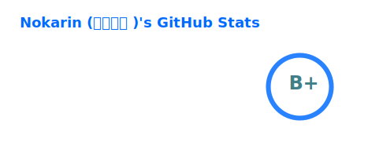
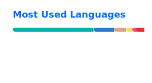

<p align="center">
  
</p>

<div align="center">

  <!-- Support -->
  [](https://www.buymeacoffee.com/nokarin)
  
  [](https://trakteer.id/nokarin)
  [](https://ko-fi.com/nokarin)
  [](https://opencollective.com/nokarin)
  
  <!-- Badges -->
  
  
  

</div>

---

### 🧠 Currently Learning

<p align="center">
  
</p>

---

### 🛠️ Tech Stack

<p align="center">
  
</p>
<p align="center">
  
</p>

---

### 📊 GitHub Stats

<div align="center">
  
  
  
</div>

---

### ⌛ WakaTime Stats

<!--START_SECTION:waka-->


**I'm an Early 🐤** 

```text
🌞 Morning                275 commits         ⣿⣿⣿⣿⣿⣀⣀⣀⣀⣀⣀⣀⣀⣀⣀⣀⣀⣀⣀⣀⣀⣀⣀⣀⣀   18.39 % 
🌆 Daytime                525 commits         ⣿⣿⣿⣿⣿⣿⣿⣿⣿⣀⣀⣀⣀⣀⣀⣀⣀⣀⣀⣀⣀⣀⣀⣀⣀   35.12 % 
🌃 Evening                645 commits         ⣿⣿⣿⣿⣿⣿⣿⣿⣿⣿⣿⣀⣀⣀⣀⣀⣀⣀⣀⣀⣀⣀⣀⣀⣀   43.14 % 
🌙 Night                  50 commits          ⣿⣀⣀⣀⣀⣀⣀⣀⣀⣀⣀⣀⣀⣀⣀⣀⣀⣀⣀⣀⣀⣀⣀⣀⣀   03.34 % 
```


📊 **This Week I Spent My Time On** 

```text
💬 Programming Languages: 
Rust                     15 hrs 11 mins      ⣿⣿⣿⣿⣿⣿⣿⣿⣀⣀⣀⣀⣀⣀⣀⣀⣀⣀⣀⣀⣀⣀⣀⣀⣀   33.21 % 
Dart                     13 hrs 20 mins      ⣿⣿⣿⣿⣿⣿⣿⣀⣀⣀⣀⣀⣀⣀⣀⣀⣀⣀⣀⣀⣀⣀⣀⣀⣀   29.17 % 
YAML                     10 hrs 54 mins      ⣿⣿⣿⣿⣿⣿⣀⣀⣀⣀⣀⣀⣀⣀⣀⣀⣀⣀⣀⣀⣀⣀⣀⣀⣀   23.84 % 
CMake                    1 hr 14 mins        ⣿⣀⣀⣀⣀⣀⣀⣀⣀⣀⣀⣀⣀⣀⣀⣀⣀⣀⣀⣀⣀⣀⣀⣀⣀   02.71 % 
TOML                     59 mins             ⣿⣀⣀⣀⣀⣀⣀⣀⣀⣀⣀⣀⣀⣀⣀⣀⣀⣀⣀⣀⣀⣀⣀⣀⣀   02.18 % 

🔥 Editors: 
VS Code                  31 hrs 9 mins       ⣿⣿⣿⣿⣿⣿⣿⣿⣿⣿⣿⣿⣿⣿⣿⣿⣿⣀⣀⣀⣀⣀⣀⣀⣀   68.13 % 
IntelliJ IDEA            14 hrs 34 mins      ⣿⣿⣿⣿⣿⣿⣿⣿⣀⣀⣀⣀⣀⣀⣀⣀⣀⣀⣀⣀⣀⣀⣀⣀⣀   31.87 % 

🐱‍💻 Projects: 
aqloss                   29 hrs 41 mins      ⣿⣿⣿⣿⣿⣿⣿⣿⣿⣿⣿⣿⣿⣿⣿⣿⣀⣀⣀⣀⣀⣀⣀⣀⣀   64.91 % 
flathub                  6 hrs 38 mins       ⣿⣿⣿⣿⣀⣀⣀⣀⣀⣀⣀⣀⣀⣀⣀⣀⣀⣀⣀⣀⣀⣀⣀⣀⣀   14.54 % 
FrameExtractor_Flutter   4 hrs 18 mins       ⣿⣿⣀⣀⣀⣀⣀⣀⣀⣀⣀⣀⣀⣀⣀⣀⣀⣀⣀⣀⣀⣀⣀⣀⣀   09.41 % 
rust                     2 hrs 46 mins       ⣿⣿⣀⣀⣀⣀⣀⣀⣀⣀⣀⣀⣀⣀⣀⣀⣀⣀⣀⣀⣀⣀⣀⣀⣀   06.08 % 
winget-pkgs              1 hr 49 mins        ⣿⣀⣀⣀⣀⣀⣀⣀⣀⣀⣀⣀⣀⣀⣀⣀⣀⣀⣀⣀⣀⣀⣀⣀⣀   04.00 % 

💻 Operating System: 
Linux                    45 hrs 44 mins      ⣿⣿⣿⣿⣿⣿⣿⣿⣿⣿⣿⣿⣿⣿⣿⣿⣿⣿⣿⣿⣿⣿⣿⣿⣿   100.00 % 
```


<!--END_SECTION:waka-->

---

### 🎧 Now / Recently Playing

<div align="center">
  
</div>

---

<p align="center">
  
</p>

---

<div align="center">
  
</div>
