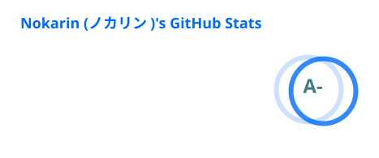
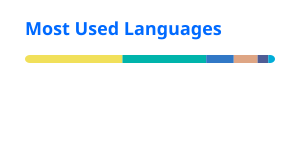

<p align="center">
  
</p>

<div align="center">

  <!-- Support -->
  [](https://www.buymeacoffee.com/nokarin)
  
  [](https://trakteer.id/nokarin)
  [](https://ko-fi.com/nokarin)
  [](https://opencollective.com/nokarin)
  
  <!-- Badges -->
  
  
  

</div>

---

### 🧠 Currently Learning

<p align="center">
  
</p>

---

### 🛠️ Tech Stack

<p align="center">
  
</p>
<p align="center">
  
</p>

---

### 📊 GitHub Stats

<div align="center">
  
  
  
</div>

---

### ⌛ WakaTime Stats

<!--START_SECTION:waka-->


**I'm an Early 🐤** 

```text
🌞 Morning                736 commits         ⣿⣿⣿⣿⣿⣿⣀⣀⣀⣀⣀⣀⣀⣀⣀⣀⣀⣀⣀⣀⣀⣀⣀⣀⣀   22.65 % 
🌆 Daytime                1181 commits        ⣿⣿⣿⣿⣿⣿⣿⣿⣿⣀⣀⣀⣀⣀⣀⣀⣀⣀⣀⣀⣀⣀⣀⣀⣀   36.34 % 
🌃 Evening                1248 commits        ⣿⣿⣿⣿⣿⣿⣿⣿⣿⣿⣀⣀⣀⣀⣀⣀⣀⣀⣀⣀⣀⣀⣀⣀⣀   38.40 % 
🌙 Night                  85 commits          ⣿⣀⣀⣀⣀⣀⣀⣀⣀⣀⣀⣀⣀⣀⣀⣀⣀⣀⣀⣀⣀⣀⣀⣀⣀   02.62 % 
```


📊 **This Week I Spent My Time On** 

```text
💬 Programming Languages: 
Markdown                 6 hrs 31 mins       ⣿⣿⣿⣿⣿⣿⣿⣿⣿⣿⣀⣀⣀⣀⣀⣀⣀⣀⣀⣀⣀⣀⣀⣀⣀   41.92 % 
JSON                     4 hrs 39 mins       ⣿⣿⣿⣿⣿⣿⣿⣀⣀⣀⣀⣀⣀⣀⣀⣀⣀⣀⣀⣀⣀⣀⣀⣀⣀   29.89 % 
Dart                     3 hrs 30 mins       ⣿⣿⣿⣿⣿⣿⣀⣀⣀⣀⣀⣀⣀⣀⣀⣀⣀⣀⣀⣀⣀⣀⣀⣀⣀   22.54 % 
YAML                     35 mins             ⣿⣀⣀⣀⣀⣀⣀⣀⣀⣀⣀⣀⣀⣀⣀⣀⣀⣀⣀⣀⣀⣀⣀⣀⣀   03.82 % 
CMake                    8 mins              ⣀⣀⣀⣀⣀⣀⣀⣀⣀⣀⣀⣀⣀⣀⣀⣀⣀⣀⣀⣀⣀⣀⣀⣀⣀   00.93 % 

🔥 Editors: 
VS Code                  11 hrs 51 mins      ⣿⣿⣿⣿⣿⣿⣿⣿⣿⣿⣿⣿⣿⣿⣿⣿⣿⣿⣿⣀⣀⣀⣀⣀⣀   76.16 % 
Cursor                   3 hrs 29 mins       ⣿⣿⣿⣿⣿⣿⣀⣀⣀⣀⣀⣀⣀⣀⣀⣀⣀⣀⣀⣀⣀⣀⣀⣀⣀   22.48 % 
Agent                    12 mins             ⣀⣀⣀⣀⣀⣀⣀⣀⣀⣀⣀⣀⣀⣀⣀⣀⣀⣀⣀⣀⣀⣀⣀⣀⣀   01.36 % 

🐱‍💻 Projects: 
aqloss                   14 hrs 44 mins      ⣿⣿⣿⣿⣿⣿⣿⣿⣿⣿⣿⣿⣿⣿⣿⣿⣿⣿⣿⣿⣿⣿⣿⣿⣀   94.75 % 
portofolio               35 mins             ⣿⣀⣀⣀⣀⣀⣀⣀⣀⣀⣀⣀⣀⣀⣀⣀⣀⣀⣀⣀⣀⣀⣀⣀⣀   03.77 % 
cyris                    10 mins             ⣀⣀⣀⣀⣀⣀⣀⣀⣀⣀⣀⣀⣀⣀⣀⣀⣀⣀⣀⣀⣀⣀⣀⣀⣀   01.09 % 
src                      3 mins              ⣀⣀⣀⣀⣀⣀⣀⣀⣀⣀⣀⣀⣀⣀⣀⣀⣀⣀⣀⣀⣀⣀⣀⣀⣀   00.39 % 
Unknown Project          0 secs              ⣀⣀⣀⣀⣀⣀⣀⣀⣀⣀⣀⣀⣀⣀⣀⣀⣀⣀⣀⣀⣀⣀⣀⣀⣀   00.00 % 

💻 Operating System: 
Linux                    15 hrs 33 mins      ⣿⣿⣿⣿⣿⣿⣿⣿⣿⣿⣿⣿⣿⣿⣿⣿⣿⣿⣿⣿⣿⣿⣿⣿⣿   100.00 % 
```


<!--END_SECTION:waka-->

---

<p align="center">
  
</p>

---

<div align="center">
  
</div>
